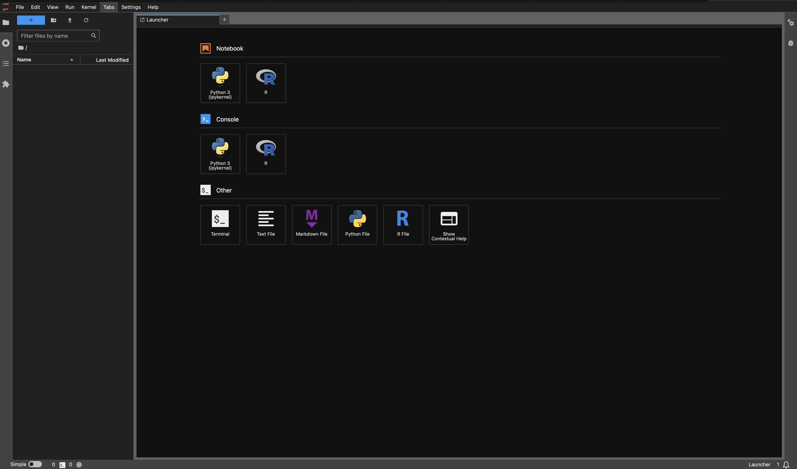

# docker bio

Docker image contains some bioinformatics tools.



## Using Docker CLI

```shell
docker run -d -p 9875:9875 rayyounghong/bio

# or mount host folders
docker run -d -p 9875:9875 -v ./workspace:/workspace -v ./.juipter:/root/.jupyter rayyounghong/bio
```

visit [http://localhost:9875](http://localhost:9875).


## Using `docker-compose.yaml`

```yaml
version: '3'
services:
  bio:
    image: rayyounghong/bio:latest
    container_name: bio
    volumes:
      - ./workspace:/workspace
      - ./.jupyter:/root/.jupyter
    working_dir: /workspace
    ports:
      - "9875:9875/tcp"
    restart: always
```

```shell
$ docker compose up -d
```

visit [http://localhost:9875](http://localhost:9875).